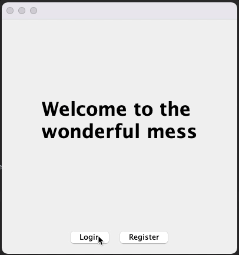

# SwingNavigationControllerPane

**This is an experiment** using Swing to produce a single window navigation controller capable of pushing and poping "views".

The intention is to provide a workflow which is decoupled, so the indiviual views don't care about "how" the navigation gets done, their only responsibility is to notify the observer(s) that some state has changed, which in turn may trigger a navigation to a new view.

The API also provides a "optional" `interface` for views that might want/need to know when a navigation is taking place

# Requirements

 

# Why?

Why not?  It's cool!  I mean, just look at it, it's cool!

# But what about `CardLayout`?

Good question!  What about it?

Seriously, `CardLayout` is a great option for switching between known views.  It's not very good at transitioning state through those views, for example, a login or registration flow, where data might need to pass from one view to another.  It can be done, but I don't find it all that easy or clean to do.

`CardLayout` also requires all the views to be instansiated up-front (again, you "can" get around it, but it's kind of messy)

Again, this is an **experiment!**.  Besides, it looks cool!

# Basic Design

The API consists of a model, view and controller.  In most cases, you shouldn't need to modify/extend from the model or view, the controller (or coordinator) is responsible for managing the naviagtion logic and creating the physical components used by the view.

## The madness behind the design...

One of the core issues I was struggling with was to decouple the model from the view.  This should make the model agnostic, but it should also not be dealing with the physical components, that's not it's responsibility.  The model should simply provide a logic representation of the current navigation stack.

I originally had the navigation pane controlling the logic and view component generation, but the navigation pane has a complex workflow and I felt that extending from it could cause no end of issues, instead I was trying to focus on providing a compestion or dependency injection workflow.

### The "controller"

Step in "the controller".  This is a bridge between the model and the navigation view.  It interacts with the model and navigation view and coordinates the business logic.  It also creates the physical components used to represent the model data.

One of the (many) reasons for doing it this way was about how to maintain context.  In the inclueded simple example, we need some way to track the "current user", as this needs to be injected into the workflow (arguably it could be controlled via the `UserService`, but the point was to demonstrate how data could be passed between views).

In this way, the controller acts as a data source for the given navigation workflow (remember, a navigation workflow should focus on a single desirable stack, if you need to have multiple workflows, then use more stacks, the API can present a new navigation view within an existing naviagtion view after all).  This can greatly simplifies the data which is passed between views and reduce the need to expose data which a individual view simple doesn't need.

### Animation and layout

Swing layout managers are really meant to perform animation.  While the example makes use of a common layout manager, a better solution would be to take control over the layout directly (probably via the navigation container component direcly)
